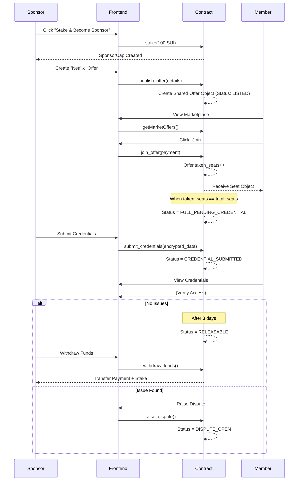
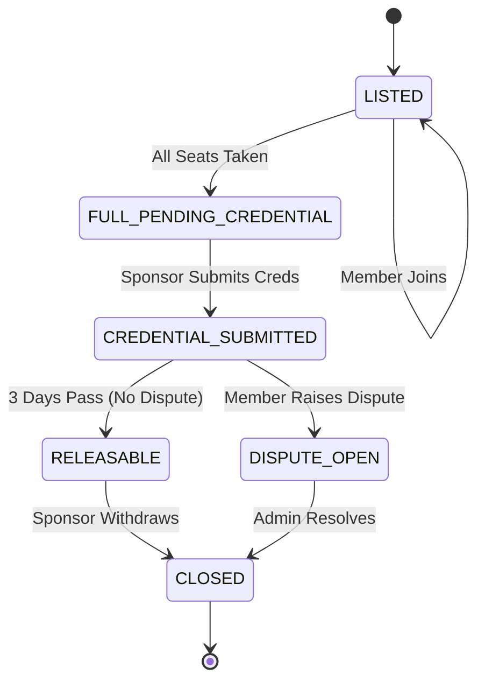
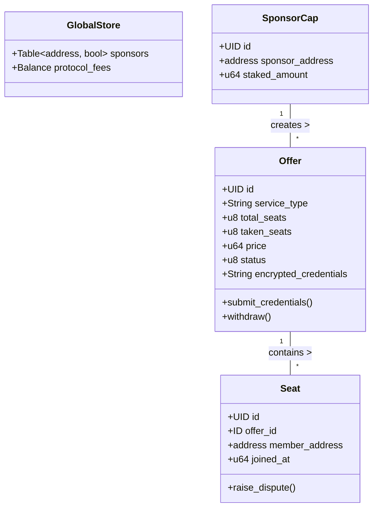

# ShareMarket API & Smart Contract Requirements

This document outlines the requirements for the Smart Contract and Backend (Indexer) teams to support the ShareMarket frontend application.

## 1. Smart Contract Requirements

The frontend expects a Move package that provides the following public entry functions.

### A. Sponsor Module

#### 1. Stake to Become Sponsor
*   **Function**: `stake`
*   **Description**: Allows a user to stake SUI tokens to become a registered sponsor.
*   **Arguments**:
    *   `payment`: `Coin<SUI>` (The stake amount, e.g., 100 SUI)
*   **Effect**: Creates a `SponsorCap` or registers the address in a global table.

#### 2. Publish Offer
*   **Function**: `publish_offer`
*   **Description**: Creates a new subscription offer.
*   **Arguments**:
    *   `sponsor_cap`: `&mut SponsorCap` (Proof of sponsorship)
    *   `service_type`: `String` (e.g., "Netflix")
    *   `title`: `String`
    *   `description`: `String`
    *   `price_per_seat`: `u64`
    *   `total_seats`: `u8`
    *   `period`: `u8` (0 = Monthly, 1 = Annual)
    *   `tags`: `vector<String>`
*   **Effect**: Creates a shared `Offer` object.

#### 3. Submit Credentials
*   **Function**: `submit_credentials`
*   **Description**: Sponsor submits the account credentials after the offer is fully booked.
*   **Arguments**:
    *   `sponsor_cap`: `&SponsorCap`
    *   `offer`: `&mut Offer`
    *   `encrypted_credentials`: `String` (or `vector<u8>`)
*   **Effect**: Updates `Offer` status to `CREDENTIAL_SUBMITTED`, starts the 3-day verification timer.

#### 4. Withdraw Funds
*   **Function**: `withdraw_funds`
*   **Description**: Sponsor claims their payout + stake return (if applicable) after the service period or verification.
*   **Arguments**:
    *   `sponsor_cap`: `&SponsorCap`
    *   `offer`: `&mut Offer`
*   **Effect**: Transfers SUI to sponsor, updates `Offer` status to `CLOSED`.

### B. Member Module

#### 1. Join Offer
*   **Function**: `join_offer`
*   **Description**: A member pays to reserve a seat in an offer.
*   **Arguments**:
    *   `offer`: `&mut Offer`
    *   `payment`: `Coin<SUI>`
*   **Effect**: Increments `taken_seats`, creates a `Seat` object for the user.

#### 2. Raise Dispute
*   **Function**: `raise_dispute`
*   **Description**: A member reports an issue with the credentials.
*   **Arguments**:
    *   `seat`: `&Seat` (Proof of membership)
    *   `offer`: `&mut Offer`
    *   `reason`: `String`
*   **Effect**: Updates `Offer` status to `DISPUTE_OPEN`.

---

## 2. Data Structure Requirements (On-Chain Objects)

The frontend needs to query these objects. Please ensure they have public fields or getter functions.

### Offer Object
```rust
struct Offer has key, store {
    id: UID,
    sponsor: address,
    service_type: String,
    title: String,
    description: String,
    price_per_seat: u64,
    total_seats: u8,
    taken_seats: u8,
    status: u8, // 0: LISTED, 1: FULL, 2: CREDENTIALS_SUBMITTED, 3: DISPUTE, 4: CLOSED
    credentials: Option<String>, // Encrypted
    credential_deadline: u64,
    created_at: u64,
}
```

### User/Sponsor State
*   Need a way to check `is_sponsor(address)` efficiently.
*   **Preferred**: A `SponsorCap` object owned by the user, which we can find via `client.getOwnedObjects`.

---

## 3. Backend / Indexer Requirements

To avoid slow client-side iteration over on-chain objects, we request the following query capabilities (via SuiIndexer or custom API).

### Queries
1.  **`getMarketOffers()`**:
    *   Return all `Offer` objects where `status == LISTED`.
    *   Support pagination (cursor/limit).
2.  **`getSponsorOffers(address)`**:
    *   Return all `Offer` objects created by a specific sponsor address.
3.  **`getMemberSubscriptions(address)`**:
    *   Return all `Offer` objects joined by a specific member address (or via `Seat` objects owned by the member).

---

## 4. Visual Diagrams

### A. Core Workflow (Sequence Diagram)
Shows the interaction from Sponsor creation to Member joining and final Settlement.



### B. Offer Lifecycle (State Diagram)
The valid state transitions for an Offer object.



### C. Class Structure (Class Diagram)
The expected data entities and methods.


