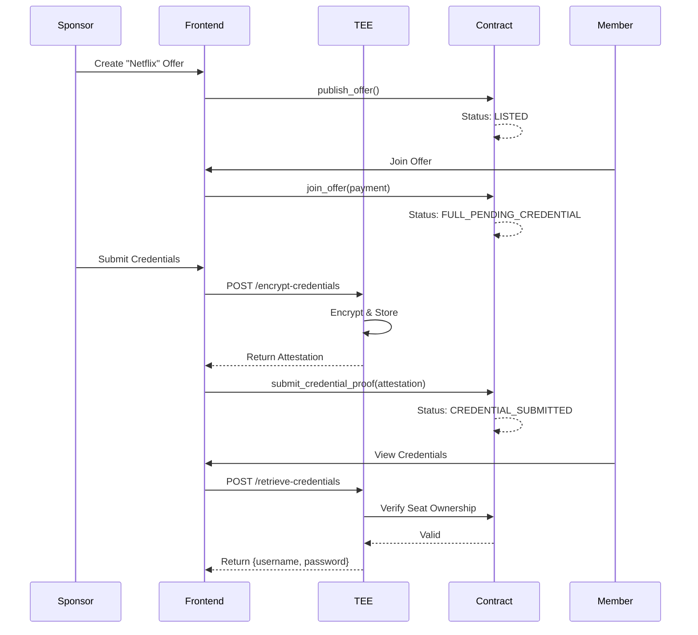
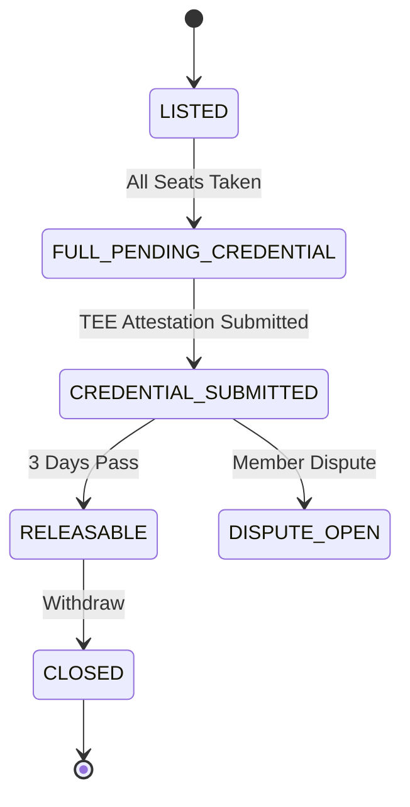

# ShareMarket API & Smart Contract Requirements

This document outlines the requirements for the Smart Contract, Backend (GraphQL), and TEE (Trusted Execution Environment) teams to support the ShareMarket frontend application.

## 1. Smart Contract Requirements

The frontend expects a Move package that provides the following public entry functions.

### A. Sponsor Module

#### 1. Stake to Become Sponsor
*   **Function**: `stake`
*   **Description**: Allows a user to stake SUI tokens to become a registered sponsor.
*   **Arguments**:
    *   `payment`: `Coin<SUI>` (The stake amount, e.g., 100 SUI)
*   **Effect**: Creates a `SponsorCap` or registers the address in a global table.

#### 2. Publish Offer
*   **Function**: `publish_offer`
*   **Description**: Creates a new subscription offer.
*   **Arguments**:
    *   `sponsor_cap`: `&mut SponsorCap` (Proof of sponsorship)
    *   `service_type`: `String` (e.g., "Netflix")
    *   `title`: `String`
    *   `description`: `String`
    *   `price_per_seat`: `u64`
    *   `total_seats`: `u8`
    *   `period`: `u8` (0 = Monthly, 1 = Annual)
    *   `tags`: `vector<String>`
*   **Effect**: Creates a shared `Offer` object with status `LISTED`.

#### 3. Submit Credentials (via TEE Flow)
*   **Function**: `submit_credential_proof` (Called by TEE or Sponsor with TEE Proof)
*   **Description**: Updates the offer status after TEE has verified and stored the credentials.
*   **Arguments**:
    *   `sponsor_cap`: `&SponsorCap`
    *   `offer`: `&mut Offer`
    *   `tee_attestation`: `vector<u8>` (Proof that TEE holds the valid credentials)
*   **Effect**: Updates `Offer` status to `CREDENTIAL_SUBMITTED`, starts the 3-day verification timer.

#### 4. Withdraw Funds
*   **Function**: `withdraw_funds`
*   **Description**: Sponsor claims their payout + stake return (if applicable) after the service period or verification.
*   **Arguments**:
    *   `sponsor_cap`: `&SponsorCap`
    *   `offer`: `&mut Offer`
*   **Effect**: Transfers SUI to sponsor, updates `Offer` status to `CLOSED`.

### B. Member Module

#### 1. Join Offer
*   **Function**: `join_offer`
*   **Description**: A member pays to reserve a seat in an offer.
*   **Arguments**:
    *   `offer`: `&mut Offer`
    *   `payment`: `Coin<SUI>`
*   **Effect**: Increments `taken_seats`, creates a `Seat` object for the user.

#### 2. Raise Dispute
*   **Function**: `raise_dispute`
*   **Description**: A member reports an issue with the credentials.
*   **Arguments**:
    *   `seat`: `&Seat` (Proof of membership)
    *   `offer`: `&mut Offer`
    *   `reason`: `String`
*   **Effect**: Updates `Offer` status to `DISPUTE_OPEN`.

---

## 2. TEE (Trusted Execution Environment) Requirements

The TEE acts as a secure middleware to handle sensitive credential data so it is never exposed on-chain in plain text.

### API Endpoints (TEE Server)

#### 1. `POST /api/tee/encrypt-credentials`
*   **Caller**: Sponsor Frontend
*   **Input**:
    *   `offerId`: String
    *   `username`: String
    *   `password`: String
*   **Process**:
    *   TEE verifies `offerId` exists and caller is owner.
    *   TEE encrypts and stores credentials in its secure enclave.
    *   TEE generates an `attestation` signature.
*   **Output**: `attestation` (to be submitted on-chain).

#### 2. `POST /api/tee/retrieve-credentials`
*   **Caller**: Member Frontend
*   **Input**:
    *   `offerId`: String
    *   `seatId`: String (Proof of purchase)
    *   `signature`: User signature verifying ownership of `seatId`
*   **Process**:
    *   TEE validates `seatId` is valid on-chain and belongs to caller.
    *   TEE decrypts credentials.
*   **Output**: `{ username, password }` (Sent over secure HTTPS/TLS)

---

## 3. Backend / GraphQL Requirements

We will implement a custom GraphQL API (using Sui GraphQL or similar) to replace standard indexing.

### Queries

#### 1. `query MarketOffers`
Fetch all available offers for the marketplace.
```graphql
query MarketOffers($limit: Int!, $cursor: String, $service: String) {
  offers(
    first: $limit
    after: $cursor
    filter: {
      status: LISTED
      service: $service
    }
    orderBy: { createdAt: DESC }
  ) {
    edges {
      node {
        id
        title
        description
        price
        seatsAvailable
        serviceType
        sponsorAddress
      }
    }
    pageInfo {
      hasNextPage
      endCursor
    }
  }
}
```

#### 2. `query MyActivity`
Fetch a user's sponsored offers and joined subscriptions.
```graphql
query MyActivity($address: String!) {
  sponsorOffers: offers(filter: { sponsor: $address }) {
    nodes {
      id
      status
      takenSeats
      totalSeats
    }
  }
  memberSubscriptions: seats(filter: { owner: $address }) {
    nodes {
      offer {
        id
        title
        status
        credentialsEncrypted
      }
    }
  }
}
```

---

## 4. Visual Diagrams

### A. Core Workflow (Sequence Diagram) WITH TEE



### B. Offer Lifecycle (State Diagram)


