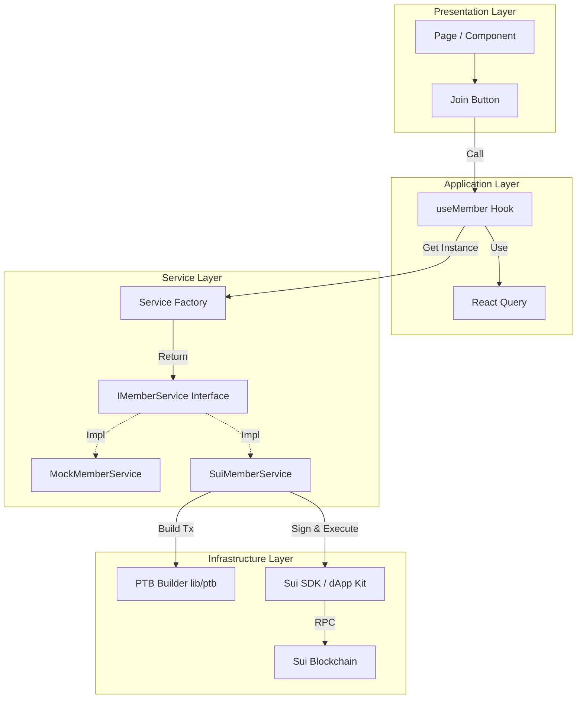

# Frontend Architecture Documentation

## Overview
This project follows a **Feature-Based Architecture** combined with an **Interface-Driven Service Layer**. The goal is to decouple the UI from the blockchain implementation, allowing for easy testing (Mock mode) and clear separation of concerns.

## Technology Stack
- **Framework**: Next.js
- **State Management**: TanStack React Query (Server state), React Context (Client state)
- **UI Components**: Radix UI / Shadcn UI (assumed based on `toast` usage)
- **Styling**: Tailwind CSS
- **Blockchain SDK**: `@mysten/dapp-kit`, `@mysten/sui`

## Architecture Layers

### 1. Presentation Layer (`src/features`, `src/components`)
- **Features**: organized by domain (e.g., `member`, `sponsor`, `marketplace`). Contains components specific to that business domain.
- **Components**: Reusable UI atoms and molecules.

### 2. Application Layer (`src/hooks`)
- **Custom Hooks** (e.g., `useMember`, `useSponsor`): Act as the bridge between UI and Services.
- Handles `useQuery` and `useMutation` logic.
- Manages local UI state (loading, error handling, toasts).
- Injects dependencies (like `signer`) into services.

### 3. Service Layer (`src/lib/services`)
- **Interfaces** (`ISponsorService`, `IMemberService`): Define the contract for business logic.
- **Factory** (`factory.ts`): Returns the concrete implementation (Mock vs. Real) based on environment.
- **Abstraction**: Hides the complexity of whether data comes from an in-memory mock or the Sui blockchain.

### 4. Infrastructure Layer (`src/lib/ptb`, `src/lib/contracts`)
- **PTB Builders**: Pure functions that construct Programmable Transaction Blocks.
- **Sui Integration**: `SuiMemberService`, `SuiSponsorService` implement the interfaces using `SuiClient`.

## Architecture Diagram

## Data Flow Example: Join Offer

1.  **User Action**: User clicks "Join" in UI.
2.  **Hook**: `useMember`'s `joinOffer` function is called.
3.  **Service Resolution**: `getMemberService()` returns `SuiMemberService`.
4.  **Transaction Construction**: `SuiMemberService` calls `buildJoinOfferPTB` to create the transaction object.
5.  **Signature**: The service asks the provided `signer` (bucketed from `useSignAndExecuteTransaction`) to sign.
6.  **Broadcast**: Transaction is sent to Sui network.
7.  **Feedback**: Hook receives the result/error and triggers a Toast notification.
8.  **Update**: `onSuccess` invalidates `my-subscriptions` query, causing a UI refresh.
